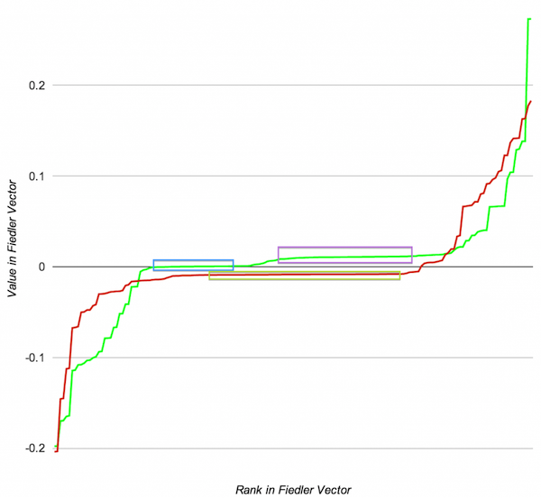

Inspectra
==========


Inspectra is a tool for spectral comparison of graph topology using python for analysis and HTML5 for interactive visualization. It calculates fiedler vectors and orders for each graph and uses them in a 2-network layout like the one above. Eigengap clustering is done client side. 


The layout used in inspectra is based on the Fiedler vector. The Fiedler vector is the eigenvector associated with the smallest non-zero eigenvalue of the graph laplacian. First described by Miroslav Fiedler in the [Czechoslovak Math Journal in 1973](http://dml.cz/bitstream/handle/10338.dmlcz/101168/CzechMathJ_23-1973-2_11.pdf), this vector is at the heart of much of algebraic graph theory.

The Laplacian is the degree matrix (which is diagonal) minus the adjacency matrix:

```
L=D-A
```

Finding the eigenvector with the smallest non-zero eigenvalue of the Laplacian is equivalent to finding the linear order of the nodes of the graph that minimizes the sum of all edge lengths. This is intuitively similar to what a force directed graph layout accomplishes but differs in a few ways:

* It can be efficiently computed with sparse matrix math instead of requiring an iterative simulation. 
* It is theoretically deterministic (though in practice this depends on the eigensolver that is used).
* There is no repulsive force between unconnected nodes, just the requirement that the solution vector have length 1.

Since the Fiedler vector is associated with the smallest non-zero eigenvalue of a sparse matrix, calculating it with most common eigensolvers will be both inaccurate and inefficient. Using the default solver in R or Matlab will not yield usable results as these solvers focus on providing the eigenvectors associated with the largest eigenvalues. For best results you must use a sparse solver that can be specifically targeted to find a few eigenvectors at the low end of the spectrum. We precompute the Fiedler vectors using a smoothed aggregation preconditioner from pyAMG with scipy.sparse.linalg.lobpcg as in this example. This computation takes seconds on graphs with thousands of nodes.

The values associated with each node in the Fiedler vector are often analyzed to identify clusters that correspond to communities of tightly linked nodes or gaps that correspond to minimal energy graph cuts. Lets look at these values for two networks derived from subtypes of Melanoma (referred to hence forth as the red and green networks):



In this plot the value of each element/node has been plotted against its rank (sorted order). I’ve highlighted a few flat spots that correspond to large tightly linked communities in each network; the red network has a large central community (yellow box) while the green network has two central communities (blue and purple boxes) of close to equal size that aren’t as strongly linked.

In Inspectra we use the Fiedler rank from the red network on the y axis and the Fiedler rank from the green network in the x axis. The same clusters seen above are in the plot at the top of this page. Edges in yellow indicate edges that occur in both networks and, of course, the colors can be changed in the webapp.

Inspectra is built to tackle large networks. The bellow graph is a ~60k edge comparison between networks in two subsets of Glioblastoma, at this scale clusters that occur only in the green network appear as vertical stripes, clusters that occur only in the red network appear as horizontal strips and cluster that are associated in both show up as yellow blobs in the center.


Since we’ve precomputed the values and ranks of the Fiedler vector for each graph, the layout of each comparison is deterministic. We can quickly and analytically identify clusters in each network inside a web browser using javascript. In the web application the user can adjust the cutoff using a slider and immediately see the resulting clusters. The user can select these clusters for further analysis or brush with the mouse to select interesting subsets of nodes.

 Inspectra is being developed as part of our work on [The Cancer Genome Atlas](http://cancergenome.nih.gov/). A live demo is running at [http://vis.systemsbiology.net/inspectra/](http://vis.systemsbiology.net/inspectra/).

 Inspectra was awarded "Best Poster" at BioVis 2013.

Python Dependencies
----------------
Calculation of Fiedler vectors depends on:
* Numpy http://www.numpy.org/
* Scipy http://www.scipy.org/install.html
* PyAmg https://code.google.com/p/pyamg/

Importing Data: Quick Start
---------------
```bash
#calculate fiedler vectors for corelation > .8 networks in directory
ls *.pwpv | xargs --max-procs=8 -I FILE  python fiedler.py FILE .8
#OR calculate for the 4th (startign from zero column) without a cutoff
ls *.pwpv | xargs --max-procs=8 -I FILE  python fiedlerByCol.py.py FILE 4

#intersect graph1 and graph2 for comparison
cross_graphs.py --graph1 graph1.pwpv.0.8.json --graph2 graph2.pwpv.0.8.json --output graph1.vs.graph2.0.8.json

#upload the result (can also be done via the ui)
uploadComp.py http://MYHOST:9400/ graph1.vs.graph2.0.8.json

```

Importing Data: Details
-----------------

Preparing neworks for inspectra is a two step process:
* Run fiedler.py on each network to calculate fiedler vectors and ranks
* Run cross_graphs.py on each pair of networks to merge graphs and pack data for consumption by the ui

Supports two arguments, the input file and an optional cutoff:

fiedler.py FILE [CUTOFF]
fiedler.py graph1.pwpv 0.1

The input file should be a space deliminated file and will be parsed as:
* Default, unweighted graph: 
    node1	node2 
* ".pwpv"/".tsv", weighted graph/Pairwise output: 
    node1	node2	weight
* ".out", rf-ace importance file: 
    node1	node2	ignored	weight

Trailing columns will be ignored.

Additional import types can be supported by importing fiedler.py as fiedlerByCol.py does:

```python
import sys
import math
import json
import os

import fiedler

def main():
    fn = sys.argv[1]

    col = int(sys.argv[2])

    fo=open(fn)
    (adj_list, iByn, nByi) = fiedler.file_parse(fo, node2=1, val_col=col)
    fo.close()

    fn = os.path.basename(fn)
    fied = fiedler.fiedler(adj_list, fn=fn, plot=False, n_fied=2)
    
    fied["adj"] = adj_list
    fied["iByn"] = iByn
    fied["nByi"] = nByi
    fo = open(fn + ".json", "w")
    json.dump(fied, fo)
    fo.close()


if __name__ == '__main__':
    main()

```


