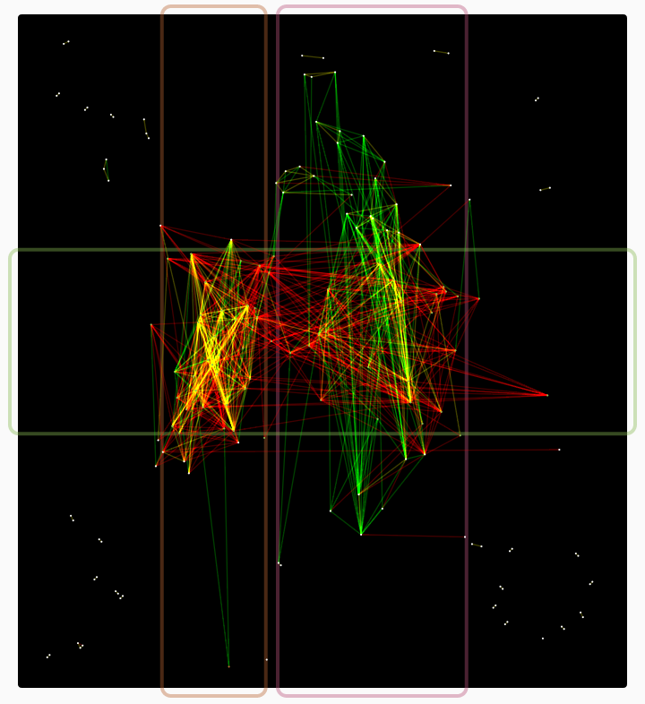

Inspectra
==========



Inspectra is a tool for spectral comparison of graph topology using python for analysis and HTML5 for interactive visualization. It calculates fiedler vectors and orders for each graph and uses them in a 2-network layout like the one above. Eigengap clustering is done client side. A live demo is running at http://vis.systemsbiology.net/inspectra/ .


Python Dependencies
----------------
Calculation of Fiedler vectors depends on:
* Numpy http://www.numpy.org/
* Scipy http://www.scipy.org/install.html
* PyAmg https://code.google.com/p/pyamg/

Importing Data: Quick Start
---------------
```bash
#calculate fiedler vectors for corelation > .8 networks in directory
ls *.pwpv | xargs --max-procs=8 -I FILE  python fiedler.py FILE .8
#OR calculate for the 4th (startign from zero column) without a cutoff
ls *.pwpv | xargs --max-procs=8 -I FILE  python fiedlerByCol.py.py FILE 4

#intersect graph1 and graph2 for comparison
cross_graphs.py --graph1 graph1.pwpv.0.8.json --graph2 graph2.pwpv.0.8.json --output graph1.vs.graph2.0.8.json

#upload the result (can also be done via the ui)
uploadComp.py http://MYHOST:9400/ graph1.vs.graph2.0.8.json

```

Importing Data: Details
-----------------

Preparing neworks for inspectra is a two step process:
* Run fiedler.py on each network to calculate fiedler vectors and ranks
* Run cross_graphs.py on each pair of networks to merge graphs and pack data for consumption by the ui

Supports two arguments, the input file and an optional cutoff:

fiedler.py FILE [CUTOFF]
fiedler.py graph1.pwpv 0.1

The input file should be a space deliminated file and will be parsed as:
* Default, unweighted graph: 
    node1	node2 
* ".pwpv"/".tsv", weighted graph/Pairwise output: 
    node1	node2	weight
* ".out", rf-ace importance file: 
    node1	node2	ignored	weight

Trailing columns will be ignored.

Additional import types can be supported by importing fiedler.py as fiedlerByCol.py does:

```python
import sys
import math
import json
import os

import fiedler

def main():
    fn = sys.argv[1]

    col = int(sys.argv[2])

    fo=open(fn)
    (adj_list, iByn, nByi) = fiedler.file_parse(fo, node2=1, val_col=col)
    fo.close()

    fn = os.path.basename(fn)
    fied = fiedler.fiedler(adj_list, fn=fn, plot=False, n_fied=2)
    
    fied["adj"] = adj_list
    fied["iByn"] = iByn
    fied["nByi"] = nByi
    fo = open(fn + ".json", "w")
    json.dump(fied, fo)
    fo.close()


if __name__ == '__main__':
    main()

```


